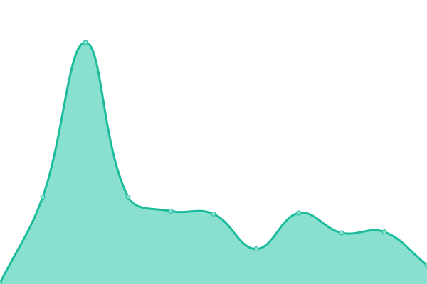
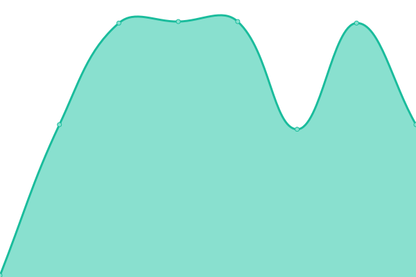
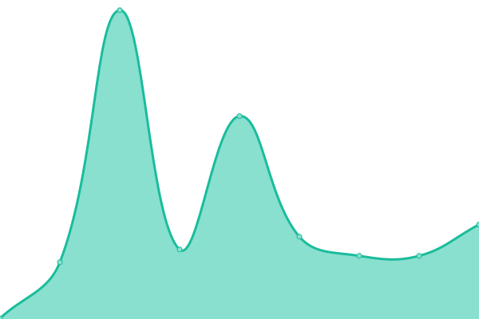

# [📈 Live Status](https://gewoonyani2.github.io/Coens-Customs-Status): <!--live status--> **🟧 Partial outage**

This repository contains the open-source uptime monitor and status page for [gewoonyani2](https://gewoonyani2.github.io/Coens-Customs-Status), powered by [Upptime](https://github.com/upptime/upptime).

With [Upptime](https://upptime.js.org), you can get your own unlimited and free uptime monitor and status page, powered entirely by a GitHub repository. We use [Issues](https://github.com/gewoonyani2/Coens-Customs-Status/issues) as incident reports, [Actions](https://github.com/gewoonyani2/Coens-Customs-Status/actions) as uptime monitors, and [Pages](https://gewoonyani2.github.io/Coens-Customs-Status) for the status page.

<!--start: status pages-->
<!-- This summary is generated by Upptime (https://github.com/upptime/upptime) -->
<!-- Do not edit this manually, your changes will be overwritten -->
<!-- prettier-ignore -->
| URL | Status | History | Response Time | Uptime |
| --- | ------ | ------- | ------------- | ------ |
|  [Main Bot](https://66.94.113.204:6191) | 🟥 Down | [main-bot.yml](https://github.com/gewoonyani2/Coens-Customs/commits/HEAD/history/main-bot.yml) | 

 146ms
     
 | 

<a href="https://gewoonyani2.github.io/Coens-Customs/history/main-bot">98.57%</a>
    

|  [Hub Bot](https://en.wikipedia.org) | 🟩 Up | [hub-bot.yml](https://github.com/gewoonyani2/Coens-Customs/commits/HEAD/history/hub-bot.yml) | 

 234ms
     
 | 

<a href="https://gewoonyani2.github.io/Coens-Customs/history/hub-bot">100.00%</a>
    

|  [WebSite](https://news.ycombinator.com) | 🟩 Up | [web-site.yml](https://github.com/gewoonyani2/Coens-Customs/commits/HEAD/history/web-site.yml) | 

 250ms
     
 | 

<a href="https://gewoonyani2.github.io/Coens-Customs/history/web-site">100.00%</a>
    

<!--end: status pages-->

[**Visit our status website →**](https://gewoonyani2.github.io/Coens-Customs-Status)

## 📄 License

- Powered by: [Upptime](https://github.com/upptime/upptime)
- Code: [MIT](./LICENSE) © [Anand Chowdhary](https://anandchowdhary.com), supported by [Pabio](https://pabio.com)
- Data in the `./history` directory: [Open Database License](https://opendatacommons.org/licenses/odbl/1-0/)
